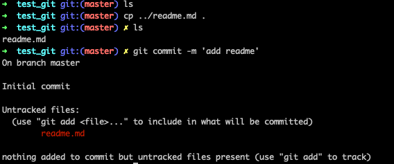

## git 最小配置

```
git config --local  只对某个仓库有效 （优先级最高，同时设置了相同的参数如邮箱，local的优先生效）
git config --global  对当前用于所有仓库有效
git config --system  对系统所以登陆的用户有效

//显示config的配置，加--list
git config --list --local
```

## 建 git 仓库

1.把已有的项目代码纳入 Git 管理

```
cd 项目代码所在的文件夹
git init
```

2.新建的项目直接用 Git 管理

```
cd 某个文件夹
git init your_project #会在当前路径下创建和项目名称同名的文件夹
cd your project
```

## 认识工作区和暂存区

git add 可以加某个文件或文件夹，也可加多个文件(可混合使用)。

```
 git add style.css（文件） testfolder（文件夹）
```

对于已经被 git 管理的（添加到暂存区的）项目更新、修改（批量），使用 git add -u
git log 查看当前 git 的 commit 版本，以及历史版本。

## 给文件重命名的简便方法

git reset --hard 删除掉暂存区和工作目录里的所有操作记录
git mv readme.md readme 重命名文件并添加到暂存区

## 通过 git log 查看版本演变历史（可组合使用）

git log 默认只显示当前分支的 commit 信息
git log \<branch\> 显示 branch 分支的 commit 信息
git log --all 显示所有分支的 commit 信息
git log --graphy 图形化显示 commit 信息
git log --oneline 查看简洁的 commit 信息
git log -n3 显示最近三次的 commit 信息
git help --web log 打开浏览器的 git log 仓库接口信息

## commit blob tree 三者之间的关系


## 进一步理解 HEAD 和 branch

git checkout -b 'new branch' 'based branch'
git diff 'one commit' 'another commit' 比较两个分支
git diff HEAD HEAD^ 比较 HEAD 和 HEAD 的父节点 commit
git diff HEAD HEAD^^ === git diff HEAD HEAD~2 比较 HEAD 和 HEAD 的父节点的父节点 commit

## 错误原因


发生了改动（readme.md),但是没有增加到暂存区（git commit -m 'add readme'）,报错。

分离头指针会导致代码丢失
